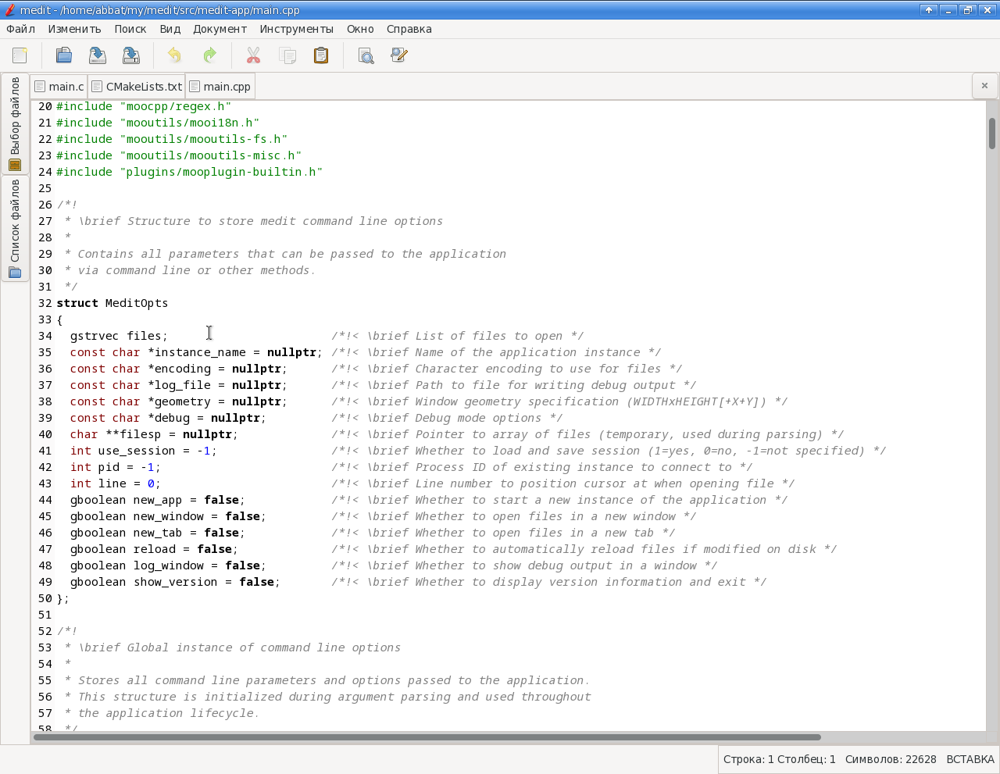

# medit

<a href="doc/screenshot.png"></a>

A maintained fork of **medit** (also known as **mooedit**) — a light, fast GTK
text editor with tabs, syntax highlighting, a file selector, find in files,
ctags navigation, a terminal pane, language server support and user defined
tools.

Upstream stopped at 1.2.92 in 2017. Its author called the editor "rather dead
than alive" [\[1\]](https://sourceforge.net/p/mooedit/discussion/571682/thread/87dbc94e/#2e8e),
suggested gedit or vs code instead [\[2\]](https://sourceforge.net/p/mooedit/discussion/571682/thread/87dbc94e/#2a00/172c/4cbb),
and offered to help anyone willing to port it to gtk-3 [\[3\]](https://sourceforge.net/p/mooedit/discussion/571682/thread/87dbc94e/#2a00).
Meanwhile, because medit needed python2 and GTK+2, it was dropped after
Debian 10 and Ubuntu 20.04 — the Debian package is
[gone](https://tracker.debian.org/pkg/medit) — and it is in none of the current
releases of either.

This fork brings it back: it builds against GTK+3, needs no python at all, and
ships packages for the distributions that lost it.

* original website: <https://mooedit.sourceforge.net> (old site, no longer updated)
* last upstream release: 1.2.92 (2017-11-12)
* current release of this fork: 1.3.4

## download

[**DEB packages**](http://software.opensuse.org/download.html?project=home:antonbatenev:medit&package=medit)
for Debian 12, 13 and Ubuntu 22.04, 24.04, 26.04. The page has the
repository setup instructions.

`medit` is a metapackage that pulls in `medit-gtk3`, or leaves `medit-gtk2` in
place if that is what is already installed — install one of those directly to
pick the toolkit yourself. The two are mutually exclusive, and only
`medit-gtk3` has the terminal pane.

## what this fork changes

Everything that kept medit out of the distributions is gone:

* **GTK+3.** medit builds and runs against gtk-3.24, which is what the build
  defaults to; the gtk-2.24 build is kept for older systems and
  `-DGTK_VERSION=2` selects it.
* **No python.** The dialogs used to be generated from glade files by a python
  script and parsed at runtime by a bundled copy of libglade. They are plain
  `.ui` files now, loaded by GtkBuilder from a GResource bundle, so neither the
  build nor the editor needs an interpreter. python2 was the reason medit left
  Debian; nothing in the tree runs python of any version any more.
* **Language servers.** A builtin client speaks the language server protocol to
  whichever servers are installed: problems underlined in the text and listed in
  a pane, a tree of what the document contains, go to definition, hover and
  completion. Which server handles which files is one small xml file, and
  `Tools → LSP Servers…` opens your copy of it. It needs json-glib, which does
  not depend on gtk, so both builds have it (`-DENABLE_LSP=OFF` to leave it
  out). **It is off until you switch it on** in `Preferences → Plugins`, the
  same as the ctags module: it runs other people's programs, one per project,
  and that is not something to start behind your back.
* **The terminal pane is back.** It used to be a python plugin on top of the
  GTK+2 vte; it is a builtin C++ plugin on top of vte-2.91 now, with the same
  shell, color schemes and context menu, plus an entry in the Tools menu bound
  to ``Ctrl+` ``. The GTK+2 build does not get it — vte's last GTK+2 release is
  0.28.2 from 2011 — and vte is optional either way (`-DENABLE_TERMINAL=OFF`).
* **CMake** instead of autotools. The build is out of source, so a gtk-2 and a
  gtk-3 build directory can live side by side.
* Windows, macOS, the python and lua bindings, the HTML widget and about 2000
  lines of dead code were removed.
* Bug fixes on top of 1.2.92, including a crash in the user tools preferences
  and a set of leaks.

See [NEWS](NEWS) for the full list.

## building from source

```bash
git clone https://github.com/abbat/medit.git
cd medit
cmake -S . -B build -DGTK_VERSION=3
cmake --build build -j$(nproc)
```

The binary is `build/src/medit` and runs straight from the build directory.
[INSTALL](INSTALL) has the dependencies, the build options and the details.

`main` carries the current state and every release is tagged (`v1.3.4`,
`v1.3.3`, ...), so `git checkout v1.3.4` gets the sources of a given release.
The original sources up to 1.2.92, which this fork started from, are at
<https://sourceforge.net/projects/mooedit/files/medit/>.

## bugs

Report bugs and file feature requests at
<https://github.com/abbat/medit/issues>.

## credits

medit was written by Yevgen Muntyan. This fork only keeps it running on
current systems; see [AUTHORS](AUTHORS) and [THANKS](THANKS) for everyone who
made the editor what it is.

medit is free software, released under the GNU LGPL version 2.1. See
[COPYING](COPYING) for details.

## other forks

medit is being kept alive in more than one place. If this fork does not fit
your needs, look at these:

* [fangq/medit](https://github.com/fangq/medit) — a GTK+3 port that keeps the
  python plugins instead of dropping them, moving them to python3 (`gtk3` and
  `python3` branches). Under active development, with work on a gdb based
  debugger on top; announced
  [on the upstream forum](https://sourceforge.net/p/mooedit/discussion/571682/thread/808f62d1fb/).
* [dark-penguin/medit](https://github.com/dark-penguin/medit) — upstream 1.2.92
  on GTK+2 with the python2 dependency removed and a `debian/` folder to build
  packages from; last refreshed for Debian trixie.
* [cl0ne/mooedit-sources](https://github.com/cl0ne/mooedit-sources) — not a
  fork but an archive of the upstream sources.

The Arch [AUR package](https://aur.archlinux.org/packages/medit) is maintained
as well and carries a python3 patch of its own.
